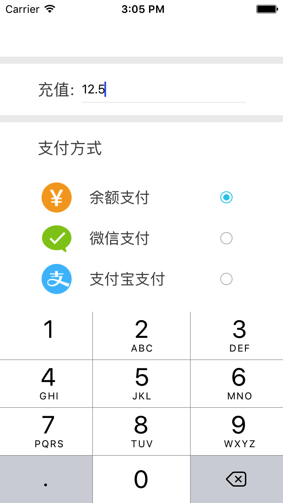

# 支付金额输入，限定输入价格类型的数字，UITextField
一个支付金额输入框，只能输入合法的金额数字，其它字符一律无法输入
在UITextField的代理里面利用正则表达式实现输入限制

核心代码：
- (BOOL)textField:(UITextField *)textField shouldChangeCharactersInRange:(NSRange)range replacementString:(NSString *)string
{

    NSString * str = [NSString stringWithFormat:@"%@%@",textField.text,string];

    //匹配以0开头的数字

    NSPredicate * predicate0 = [NSPredicate predicateWithFormat:@"SELF MATCHES %@",@"^[0][0-9]+$"];
    //匹配两位小数、整数

    NSPredicate * predicate1 = [NSPredicate predicateWithFormat:@"SELF MATCHES %@",@"^(([1-9]{1}[0-9]*|[0])\.?[0-9]{0,2})$"];

    return ![predicate0 evaluateWithObject:str] && [predicate1 evaluateWithObject:str] ? YES : NO;

}

效果图：

